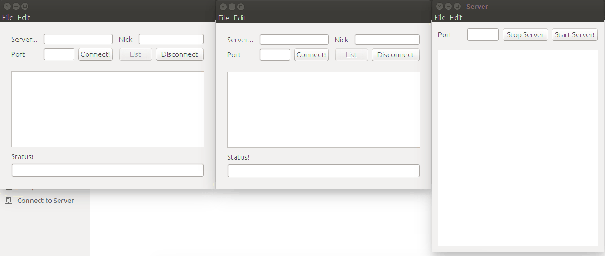

# :computer: 10k-talk
It is simple desktop chat application written in java which is light weight and portable. You can use it on your LAN and even WAN (port forwarding necessary :P )

#Demo

#Features
* Very simple to use and portable.
* Anyone on same network can connect to the server.
* Server has a live log window.
* Can connect upto 10-15 users at a time.

#Usage
:file_folder: Download the .zip [here](https://github.com/vshelke/10k-talk/blob/master/dist/deploy.zip)

* run `Server.jar`
* enter a unique port number and start the server :neckbeard:
* check your ip address on local network by typing :
  * `ipconfig` on **Windows**
  * `ifconfig` on **Linux** or **Mac**
* run `Client.jar` on any system on the same network.
* enter the ip port nickname and hit connect. enjoy! :blush:

#License
Made with :yellow_heart: by [Vaibhav Shelke](https://github.com/vshelke) under [MIT License](https://github.com/vshelke/10k-talk/blob/master/LICENSE).
